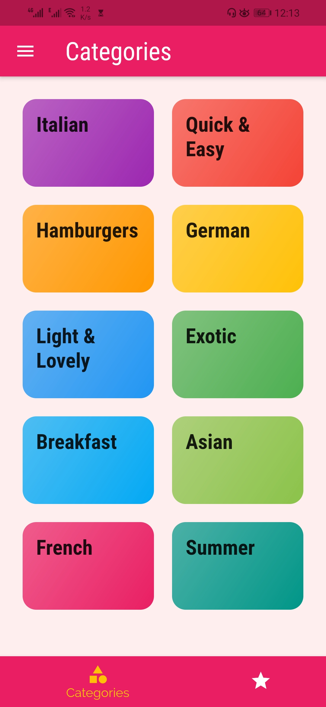
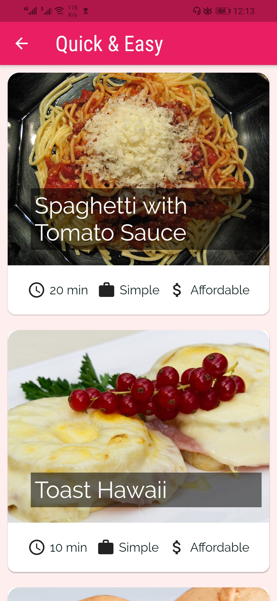
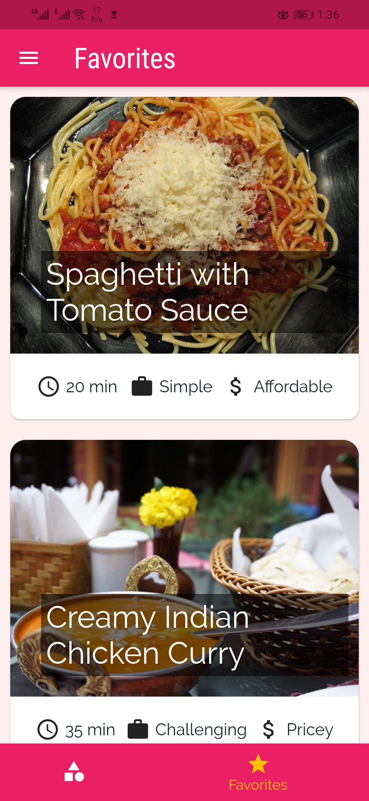
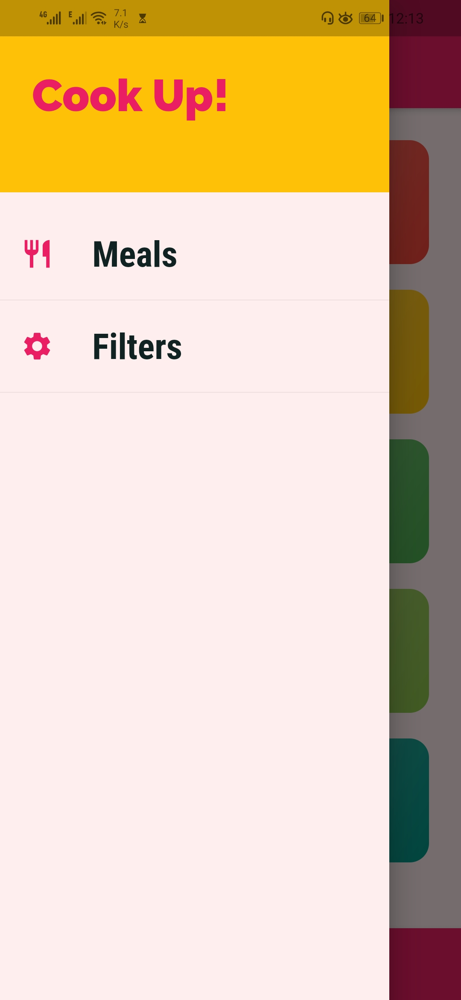
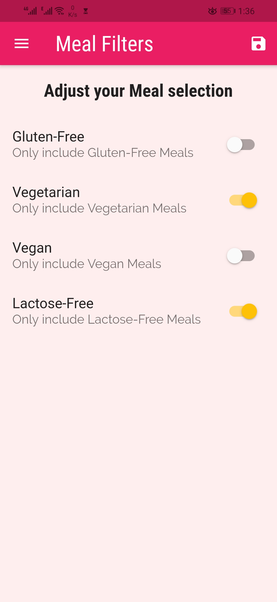

# Recipe App 

This is a Recipe app. Main purpose of this app is to demonstrate multiple Flutter & Dart Concepts. Some of the concepts are as follows:

### Concepts:
- Theming
- Navigation Bar
- Flutter Grid
- Passing data via Constructors
- Using named routes and passing the data along 
- onGenerateRoute & onUnknownRoute
- Bottom TabBar
- Custom Drawer
- Replacing Pages (Instead of Pushing)
- Popping Pages & Passing Data Back
- Filter Switches and Filtering Logic
- Mark as Favorite


## Screenshots


&nbsp;
&nbsp;
&nbsp;
&nbsp;
&nbsp;
&nbsp;


## How to run
Run following commands after cloning this repository:
```sh
$ flutter clean
$ flutter pub get
$ flutter run
```

# Third party libraries used
-None


### Bugs
- Did not face any bugs. Let me know if you found any.


# Contribution
1. Fork it
2. Create your feature branch (git checkout -b new_branch)
3. Commit your changes (git commit -m 'New feature')
4. Push to the branch (git push origin new_branch)
5. Create new Pull Request